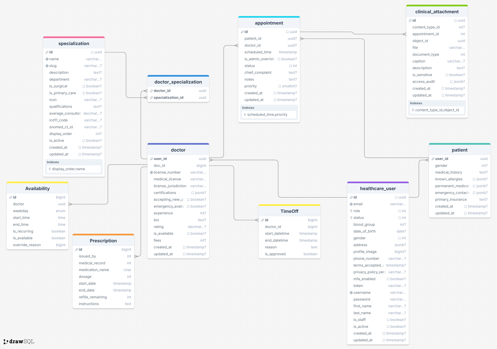

# **Tiberbu Ke Healthcare Portal**
## Backend (Django) & Frontend (React)

A full-stack healthcare management system built with Django for the backend and React for the frontend. This project uses JWT (JSON Web Tokens) for user authentication and provides access control to various features, including user login, registration, and protected endpoints.

---

## Links

1. [Documentation1](https://tiberbu.onrender.com/swagger)
2. [Documentation2](https://tiberbu.onrender.com/redoc)
3. [Front-End](https://tiberbuke.vercel.app)
4. [Screen-Cast](./tiberbu.webm)
5. [Screen-recording](https://youtu.be/-cfe9xxmIT0")

---

<iframe width="560" height="315" src="https://youtu.be/-cfe9xxmIT0" frameborder="0" allowfullscreen></iframe>

---

## **Table of Contents**

- [Project Overview](#project-overview)
- [Technologies Used](#technologies-used)
- [Backend Setup (Django)](#backend-setup-django)
- [Frontend Setup (React)](#frontend-setup-react)
- [API Endpoints](#api-endpoints)
- [Database Schema](#database)
- [Development](#development)
- [Testing](#testing)
- [Contributing](#contributing)
- [License](#license)

---

## **Project Overview**

This project is a web-based healthcare portal designed to manage patient information, appointments, prescriptions, and more. The system allows healthcare professionals (doctors) and patients to interact efficiently and securely. 

Key features include:
- Secure login and registration via JWT.
- Doctor's ability to manage time off and prescriptions.
- User roles for managing access to specific resources.
- Comprehensive user authentication with email, username, or phone number.

---

## **Technologies Used**

- **Backend**: Django, Django REST Framework (DRF)
- **Authentication**: JWT (via `djangorestframework-simplejwt`)
- **Frontend**: React.js
- **Database**: PostgreSQL (or any preferred database)
- **Development Tools**: Docker, Git
- **API Documentation**: Swagger (via `drf-yasg`)

---

## **Backend Setup (Django)**

This section guides you through setting up the backend of the project using Django and Django REST Framework.

### **1. Clone the Repository**

First, clone the project repository to your local machine:

```bash
git clone https://github.com/stephen-nene/Tiberbu.git
cd Tiberbu/api
```

### **2. Create a Virtual Environment && env**

It's a good practice to use a virtual environment to manage dependencies.

```bash
python -m venv venv
source venv/bin/activate  # On Windows, use `venv\Scripts\activate`
```
```sh
mkv    # On Zsh, with ohmyzsh`
vrun
```
We need a .env for our secrets

```sh
VITE_BACKEND_URL=http://127.0.0.1:8000/api/v1.0/
FRONTEND_URL=https://tiberbuke.vercel.app
SECRET_KEY=iuwgeuuwioehowheoifdhoqiehfioheiofh
DATABASE_URL=uiwfuiwueifouewuf
MAIL_SERVER=ejwgfjkwbrjkgfbejkbrgljb3jgrb
MAIL_USERNAME=ergui3guerjgbk
MAIL_PASSWORD=ifg3gruifui3rf
MAIL_PORT=567

DEBUG=True
ENVIRONMENT=development
```

### **3. Install Dependencies**

Install the required dependencies using `pip`.

```bash
pip install -r requirements.txt
```

### **4. Configure the Database**

Make sure to configure your database settings in `settings.py`. You can use PostgreSQL, SQLite, or any other database of your choice. If using PostgreSQL, configure the database in the following section of `settings.py`:

```python
DATABASES = {
    'default': {
        'ENGINE': 'django.db.backends.postgresql',
        'NAME': 'your_database_name',
        'USER': 'your_database_user',
        'PASSWORD': 'your_database_password',
        'HOST': 'localhost',
        'PORT': '5432',
    }
}
```

### **5. Apply Migrations**

Run the migrations to set up your database schema:

```bash
python manage.py migrate
```

### **6. Create a Superuser**

Create an admin user to access the Django admin panel:

```bash
python manage.py createsuperuser
```

### **7. Run the Development Server**

Start the Django development server:

```bash
python manage.py runserver
```

Your Django backend should now be accessible at `http://127.0.0.1:8000`.

---

## **Frontend Setup (React)**

This section will guide you on how to set up the frontend with React.

### **1. Clone the Repository**

Clone the frontend directory to your local machine:

```bash
git clone https://github.com/stephen-nene/Tiberbu.git
cd Tiberbu/client
```

### **2. Install Dependencies**

Install the necessary frontend dependencies using `pnpm`, `npm` or `yarn`.

```bash
npm install
```

or

```bash
yarn install
```

or 

```sh
pnpm install
```

### **3. Set up Environment Variables**

Create a `.env` file in the root of the frontend directory to store the API URL:

```
VITE_BACKEND_URL=http://127.0.0.1:8000/api/v1.0/
```

### **4. Run the Frontend Server**

Start the React development server:

```bash
npm start 
```

```bash
pnpm start 
```

Your React frontend should now be accessible at `http://localhost:5173`.

---

## **API Endpoints**

Here are the core API endpoints exposed by the backend:

- [Docs](https://tiberbu.onrender.com/redocs/)

- [Swagger](https://tiberbu.onrender.com/swagger/)


---


## **Database**



---

## **Development**

### **1. Running the Backend and Frontend Together**

To run both the backend and frontend simultaneously:

- **Backend**: Follow the instructions under the **Backend Setup (Django)** section.
- **Frontend**: Follow the instructions under the **Frontend Setup (React)** section.

### **2. Docker Setup (Optional)**

If you prefer using Docker, you can run both the backend and frontend with Docker Compose. This setup requires a `docker-compose.yml` file for both services (frontend and backend).

```bash
docker-compose up
```

---

## **Testing**

### **Backend Tests**

To run tests for the Django backend, use the following command:

```bash
python manage.py test
```

### **Frontend Tests**

To run tests for the React frontend, use the following command:

```bash
npm test
```

---

## **Contributing**

We welcome contributions to improve this project! Here's how you can contribute:

1. **Fork the repository**.
2. **Create a new branch** (`git checkout -b feature/your-feature`).
3. Make your changes.
4. **Commit your changes** (`git commit -am 'Add new feature'`).
5. **Push to your branch** (`git push origin feature/your-feature`).
6. Open a **pull request**.

---

## **License**

This project is licensed under the MIT License - see the [LICENSE](./LICENSE.md) file for details.

---

## **Acknowledgements**

- **Django**: For building a robust and scalable web framework.
- **Django REST Framework**: For enabling API development with minimal effort.
- **React**: For building a dynamic and responsive frontend.
- **djangorestframework-simplejwt**: For simplifying JWT authentication integration.

